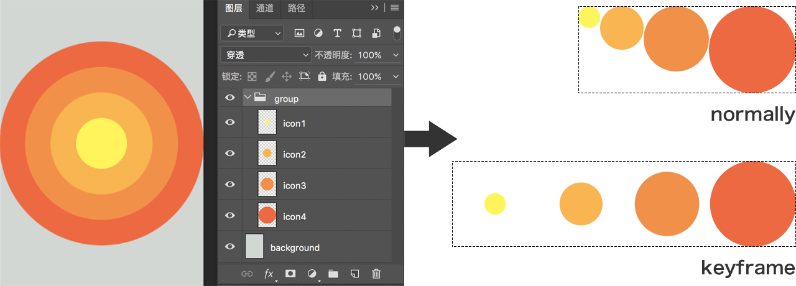

# Lia

[](https://travis-ci.org/cupools/lia)
[](https://coveralls.io/github/cupools/lia?branch=master)

`Lia` finds image resources according to `sprite_conf.js`, then builds sprite images and output stylesheet files to specify directory.

If you are tend to build sprite images according to stylesheet, maybe you like [Emilia](https://github.com/cupools/emilia).

[中文文档](README.zh-CN.md)

## Features
- Supports `rem` as well as numerical conversion.
- Output multiple sprite pictures and stylesheet files in once time.
- Monitor file changes and incremental recompilation.
- Create sprites picture in current folder easily. May be useful for css or canvas keyframes animation.
- Supports custom template for coordinates infomation. It means scss, js and any format you want can be built.
- Supports reading `.psd` directly, and then output sprite images by layers or group with information context from Photoshop.

## Getting started

#### Step 0
```bash
npm i -g lia
```

```bash
$ lia -h

  Usage: lia [command]

  Commands:

    init                   Create sprite_conf.js
    here                   Build sprite images in current directory
    -w, watch              Monitor file changes and incremental recompilation
    -h, help               Output usage information
```

#### Step 1


```bash
$ lia init
[info]: Created sprite_conf.js
```

#### Step 2

```bash
$ lia
[info]: Created build/sprite.png
[info]: Created build/sprite.css
```

That's all.

What we should be care about is `sprite_conf.js`. When `lia init`, it create the config file in current directory:

```js
// sprite_conf.js
module.exports = [{
    src: ['*.png'],
    image: 'build/sprite.png',
    style: 'build/sprite.css',
    prefix: '',
    cssPath: './',
    unit: 'px',
    convert: 1,
    decimalPlaces: 6,
    blank: 0,
    padding: 10,
    algorithm: 'binary-tree',
    tmpl: '',
    psd: '',
    quiet: false
}];
```

And in the example above, it finally outputs `sprite.css` and `sprite.png`

```css
/* build/sprite.css */
.icon0 {
    width: 256px;
    height: 256px;
    background: url('./sprite.png') no-repeat;
    background-size: 522px 366px;
    background-position: 0px 0px;
}
.icon1 {
    width: 256px;
    height: 256px;
    background: url('./sprite.png') no-repeat;
    background-size: 522px 366px;
    background-position: -266px 0px;
}
.icon2 {
    width: 100px;
    height: 100px;
    background: url('./sprite.png') no-repeat;
    background-size: 522px 366px;
    background-position: 0px -266px;
}
```


Having get those stylesheet files and sprite images, you can use it through `@extend` or directly use the selector. Whatever you like.

## Parameter
### src
- type: `Array`
- desc: origin image path, use [glob-patterns](https://github.com/isaacs/node-glob)
- default: ['*.png']

### image
- type: `String`
- desc: output path of sprite image
- default: 'build/sprite.png'

### style
- type: `String`
- desc: output path of stylesheet, can be `css`, `scss`, or with [tmpl](#tmpl) to be `js`, `json`, and any format.
- default: 'build/sprite.css'

### prefix
- type: `String`
- desc: selector prefix
- default: ''

### cssPath
- type: `String`
- desc: relative path or publish path of sprite image
- default: '../images/'

### unit
- type: `String`
- desc: css unit
- default: 'px'

### convert
- type: `Number`
- desc: numerical scale. Useful with `rem` and Retina pictures.
- default: 1

### decimalPlaces
- type: `Number`
- desc: keep the number of decimal places with `convert`
- default: 6

### blank
- type: `Number`
- desc: Create space in the edge of background container to avoid `rem` decimal calculation problem, which is common to cause background incomplete.
- default: 0

### padding
- type: `Number`
- desc: padding between pictures
- default: 10

### algorithm
- type: `String`
- desc: layout algorithm of pictures. Uses [layout](https://www.npmjs.com/package/layout)
- value: ['top-down' | 'left-right' | 'diagonal' | 'alt-diagonal' | 'binary-tree']
- default: 'binary-tree'

### tmpl
- type: `String`
- desc: the path of template file, which is used to output not only stylesheet file. Uses [Ejs](https://github.com/tj/ejs).
- default: ''

### psd
- type: `String`
- desc: the path of Photoshop file. If exist, [src](#src) should match layers' name or groups' name in `.psd`.
- default: ''

## Examples

### Easily build sprite pictures in current directory

```bash
$ lia here
[info]: Created sprite-keyframe.png
```

All the pictures in current directory will be output as a sprite image in `left-right` layout order by filename, with padding `0`. It does not output stylesheet file.

From:

 
 


To:


### 2. Monitor file change
The `sprite_conf.js` as follow.

```js
// sprite_conf
module.exports = [{
    src: ['animal/*.png'],
    image: './sprites/sp-animal.png',
    style: './sprites/sp-animal.scss',
    cssPath: './',
    unit: 'px',
}, {
    src: ['icon/*.png'],
    image: './sprites/sp-icon.png',
    style: './sprites/sp-icon.scss',
    cssPath: './',
    unit: 'px',
}];
```

And when run `lia watch`, it works.

```bash
$ lia -w
[info]: Created ./sprites/sp-animal.png
[info]: Created ./sprites/sp-animal.scss
[info]: Created ./sprites/sp-icon.png
[info]: Created ./sprites/sp-icon.scss
[info]: Finish in 76ms. Waiting...
[info]: Created ./sprites/sp-animal.png
[info]: Created ./sprites/sp-animal.scss
[info]: Finish in 32ms. Waiting...
```

### 3. Custom template with `Ejs`

`Lia` supports output file in any format with sprite coordinates by custom Ejs template. It may be helpful in canvas animation.

#### Context
The Ejs template has the follow context

```js
{
    basename: '', // sprite image's basename
    path: '', // sprites image's relative path
    realpath: '', // sprites image's realpath
    unit: '',
    size: {
        with: 0,
        height: 0
    },
    items: [{
        name: '', // origin image's basename
        size: {
            width: 0,
            height: 0
        },
        x: 0, // offset x
        y: 0, // offset y
        layer: { // Photoshop layer information if `psd` exist
            name: '', // layer name
            top: 0, // coordinate in Photoshop
            left: 0,
            right: 0,
            bottom: 0,
            width: 0,
            height: 0
        }
    }, ...],
    psd: { // Photoshop file information if `psd` exist
        width: 0,
        height: 0
    },
    _options: {} // the options you provide, can also inject some other data
}
```

The default template can be found in [template.ejs](https://github.com/cupools/lia/blob/master/src/tmpl/template.ejs)

#### Example

`sprite_conf.js` as follow.

```js
// sprite_conf.js
module.exports = [{
    src: ['test/fixtures/*.png'],
    image: 'test/tmp/sprite.png',
    style: 'test/tmp/sprite.js',
    tmpl: 'test/fixtures/template.ejs'
}];
```

Custom template file as follow.

```js
// template.ejs
var opt = {
    width: <%= size.width %>,
    height: <%= size.height %>,
    src: '<%= realpath %>',
    count: <%= items.length %>,
    items: [
<% items.forEach(function(item, idx) { -%>
    {
        index: <%= idx %>,
        name: '<%= item.name %>',
        width: <%= item.size.width %>,
        height: <%= item.size.height %>,
        x: <%= item.x %>
        y: <%= item.y %>
    },
<% }) -%>
    ]
}
```

Run in CLI.

```bash
$ lia
[info]: Created test/tmp/sprite.png
[info]: Created test/tmp/sprite.js
```

Then you get `sprite.js` and `sprite.png`

```js
// sprite.js
var opt = {
    width: 522,
    height: 256,
    src: '/Users/Lance/home/lia/test/tmp/sprite.png',
    count: 2,
    items: [
    {
        index: 0,
        name: 'icon0',
        width: 256,
        height: 256,
        x: 0
        y: 0
    },
    {
        index: 1,
        name: 'icon1',
        width: 256,
        height: 256,
        x: 266
        y: 0
    },
    ]
}
```

### 4. Work with `.psd`
It's possible to read layers or group from Photoshop directly. When `.psd` filepath is given, `src` will be the glob pattern match layers' or group's name instead of filepath.

And Lia is abled to output normally sprite image or keyframe sprite image.



```js
// normal
module.exports = [{
    src: 'icon*',
    image: 'build/sprite.png',
    style: 'build/sprite.css',
    padding: 0,
    algorithm: 'left-right',
    psd: 'demo.psd'
}]
```

```js
// keyframes
module.exports = [{
    src: 'group/',
    image: 'build/sprite.png',
    style: 'build/sprite.css',
    padding: 0,
    algorithm: 'left-right',
    psd: 'demo.psd'
}]
```

To be simple, only when `src` is a single group name that ends up with `/` will be considered to be a keyframe sprite image, and each visible layers under the group is one frame with the same size. Otherwise `src` will match layers' name in `.psd` while invisible layers and groups are ignored.

Currently to avoid get wrong size and performance of pictures, __each Photoshop layer that are expected to be outputed should be rasterized before running Lia__. It suggests to use Photoshop action to do the repeat works now. And the problem is probably to be resolve in the next version.

What's more, when running Lia, a context with Photoshop information is available in render template. It's helpful in locating element in the viewport, with CSS or JavaScript. Here is the CSS example.

Conf:

```js
module.exports = [{
    src: 'icon*',
    image: 'build/sprite.png',
    style: 'build/sprite.css',
    algorithm: 'left-right',
    padding: 0,
    tmpl: 'css.ejs',
    psd: 'demo.psd'
}]
```

Template: 

```ejs
<% items.forEach(function(item) { -%>
.<%= item.name %> {
    position: absolute;
    top: <%= item.layer.top + unit %>;
    left: <%= item.layer.left + unit %>;
    width: <%= item.size.width + unit %>;
    height: <%= item.size.height + unit %>;
    background: url('<%= path %>') no-repeat;
    background-size: cover;
    background-position: <%= -item.x + unit %> <%= -item.y + unit %>;
}
<% }) -%>
```

Output: 

```css
.icon1 {
    position: absolute;
    top: 96px;
    left: 96px;
    width: 64px;
    height: 64px;
    background: url('./sprite.png') no-repeat;
    background-size: cover;
    background-position: 0px 0px;
}
.icon2 {
    position: absolute;
    top: 64px;
    left: 64px;
    width: 128px;
    height: 128px;
    background: url('./sprite.png') no-repeat;
    background-size: cover;
    background-position: -64px 0px;
}
...
```

In addition, to keep correct order of layers from Photoshop, keyframe sprite images' item name is set as id number instead of layer name.

## Changelog
- v2.1.0
    - Supports reading `.psd` directly with option `psd`
- v2.0.0
    - Easier and stronger template supports with `Ejs`
    - Remove `option.wrap` and add `option.decimalPlaces`
    - In `$lia here`, layout now be `left-right` instead of `top-down`
    - Update default options
    - Stronger test coverage
- v1.2.2
    - Replace `Array.prototype.sort` with `lodash.sortby` to fix orders of sprite images, which may be wrong in `$lia here`
- v1.2.0
    - Use [node-images](https://github.com/zhangyuanwei/node-images) as image engine and thus greatly speed up compilation
- v1.1.1
    - Update for Node v0.12 support
- v1.1.0
    - Fix fatal bug cause by incorrect usage of `child_process.execFileSync` in windows
    - Add unit test
- v1.0.0
    - Rename from `Sprites` to `Lia`
    - Adjust default options
- v0.2.1
    - Add command `watch`, which be abled to monitor file changes
- v0.1.2
    - Add command `now` which named `here` currently, which be abled to build sprite picture in current folder
    - Fix snowball bug, sprite picture will be filter in compilation
- v0.1.1
    - Add parameter `tmpl` and `wrap`, which be abled to output json and any format file with sprit coordinats
- v0.0.1: 
    - Basic functions

## Test

```bash
npm i && npm test
```

## License

Copyright (c) 2016 cupools

Licensed under the MIT license.
