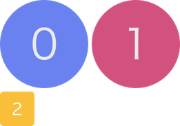

# Lia

[](https://travis-ci.org/cupools/lia)
[](https://coveralls.io/github/cupools/lia?branch=master)

`Lia` finds image resources according to `sprite_conf.js`, then builds sprite pictures and output stylesheet files to specify directory.

If you are tend to build sprite pictures according to stylesheet, maybe you like [Emilia](https://github.com/cupools/emilia).

[中文文档](README.zh-CN.md)

## Features
- Supports `rem` as well as numerical conversion.
- Output multiple sprite pictures and stylesheet files in once time.
- Monitor file changes and incremental recompilation.
- Create sprites picture in current folder easily. May be useful for css keyframes animation.
- Support custom template for stylesheet file. It means scss, json and any format you want can be outputed.

## Getting started

#### Step 0
```bash
npm i -g lia
```

```bash
$ lia -h

  Usage: lia [command]

  Commands:

    init                   Create sprite_conf.js
    here                   Build sprite pictures in current directory
    -w, watch              Monitor file changes and incremental recompilation
    -h, help               Output usage information
```

#### Step 1


```bash
$ lia init
[info]: Created sprite_conf.js
```

#### Step 2

```bash
$ lia
[info]: Created build/sprite.png
[info]: Created build/sprite.css
```

And it works.

What we should be care about is `sprite_conf.js`. When `lia init`, it looks like:

```js
// sprite_conf.js
module.exports = [{
    src: ['**/sprite-*.png'],
    image: 'build/sprite.png',
    style: 'build/sprite.css',
    prefix: '',
    cssPath: './',
    unit: 'px',
    convert: 1,
    blank: 0,
    padding: 10,
    algorithm: 'binary-tree',
    tmpl: '',
    wrap: ''
}];
```

And in the example above, it results in:

```css
/* build/sprite.css */
.sprite-icon0 {
    width: 256px;
    height: 256px;
    background: url(./sprite.png) no-repeat;
    background-size: 522px 366px;
    background-position: 0px 0px;
}
.sprite-icon1 {
    width: 256px;
    height: 256px;
    background: url(./sprite.png) no-repeat;
    background-size: 522px 366px;
    background-position: -266px 0px;
}
.sprite-icon2 {
    width: 100px;
    height: 100px;
    background: url(./sprite.png) no-repeat;
    background-size: 522px 366px;
    background-position: 0;
}
```



Having get those stylesheet files and sprite pictures, you can use it through `@extend` or directly use the selector. Whatever you like.


## Parameter
### src
- type: `Array`
- desc: origin image path, use [glob-patterns](https://github.com/isaacs/node-glob)
- default: ['\*\*/sprite-*.png']

### image
- type: `String`
- desc: sprite picture output path
- default: 'build/sprite.png'

### style
- type: `String`
- desc: stylesheet file path, can be like `css`, `scss`, or with [tmpl](#tmpl) and [wrap](#wrap) to be `js`, `json`, any format.
- default: 'build/sprite.css'

### prefix
- type: `String`
- desc: selector prefix
- default: ''

### cssPath
- type: `String`
- desc: image url path
- default: '../images/'

### unit
- type: `String`
- desc: css unit
- default: 'px'

### convert
- type: `Number`
- desc: numerical scale. Useful in `rem` and Retina pictures.
- default: 1

### blank
- type: `Number`
- desc: Create space in the edge of background container to avoid `rem` decimal calculation problem, which is common to cause background incomplete.
- default: 0

### padding
- type: `Number`
- desc: padding between images
- default: 10

### algorithm
- type: `String`
- desc: layout algorithm of sprite pictures
- value: ['top-down' | 'left-right' | 'diagonal' | 'alt-diagonal' | 'binary-tree']
- default: 'binary-tree'

### tmpl
- type: `String`
- desc: the path of template file, which is used to output not only stylesheet file. The variables are acceptable as follow: `name`, `imageName`, `totalWidth`, `width`, `totalHeight`, `height`, `x`, `y`, `unit`, `cssPath`, `image`, `selector`. Uses ES6 template.
- default: ''

### wrap
- type: `String`
- desc: a string that make up for deficiencies in [tmpl](#tmpl), such as <code>module.exports=[${content}];</code>. The variables are acceptable as follow: `content`, `totalWidth`, `totalHeight`, `imageName`. Uses ES6 template.
- default: ''

## Example

### Easily build sprite pictures in current directory

```bash
$ lia here
[info]: Created sprite-keyframes.png
```

All the pictures in current directory will be output as a sprite picture in `top-down` layout, with padding `10`. It does not output stylesheet file.

From:

 
 


To:


### 2. Monitor file change
The `sprite_conf.js` look like this.

```js
// sprite_conf
module.exports = [{
    src: ['animal/*.png'],
    image: './sprites/sp-animal.png',
    style: './sprites/sp-animal.scss',
    cssPath: './',
    unit: 'px',
}, {
    src: ['icon/*.png'],
    image: './sprites/sp-icon.png',
    style: './sprites/sp-icon.scss',
    cssPath: './',
    unit: 'px',
}];
```

And when run `lia watch`, it runs like this.

```bash
$ lia -w
[info]: Created ./sprites/sp-animal.png
[info]: Created ./sprites/sp-animal.scss
[info]: Created ./sprites/sp-icon.png
[info]: Created ./sprites/sp-icon.scss
[info]: Finish in 1.217s. Waiting...
[info]: Created ./sprites/sp-animal.png
[info]: Created ./sprites/sp-animal.scss
[info]: Finish in 0.532s. Waiting...
```

### 3. Custom template

`Lia` supports output any format files with sprite coordinates by custom template. It may be helpful in canvas animation and other usage scenarios.

`sprite_conf.js` as follow.

```js
// sprite_conf.js
module.exports = [{
    src: ['images/animal/*.png'],
    image: 'build/sprite.png',
    style: 'build/sprite.js',
    unit: 'px',
    tmpl: './obj.tmpl',
    wrap: 'module.exports={name: \'${imageName}\', totalWidth: ${totalWidth}, totalHeight: ${totalWidth}, data: [${content}]}'
}];
```

Template file `obj.tmpl` as follow.

```js
// obj.tmpl
{
    name: '${name}',
    width: ${width},
    height: ${height},
    offset: {
        x: ${x},
        y: ${y}
    }
},
```

Run in CLI.

```bash
$ lia
[info]: Created build/sprite.png
[info]: Created build/sprite.js
```

It will output `sprite.js` and `sprite.png` as follow.

```js
// sprite.js
module.exports={name: 'sprite.png', totalWidth: 451, totalHeight: 451, data: [{
    name: 'bird',
    width: 131,
    height: 210,
    offset: {
        x: 179,
        y: 0
    }
},{
    name: 'cat',
    width: 131,
    height: 178,
    offset: {
        x: 320,
        y: 0
    }
},{
    name: 'cow',
    width: 169,
    height: 219,
    offset: {
        x: 0,
        y: 0
    }
},]}
```

## Update
- v1.2.2
    - Replace `Array.prototype.sort` with `lodash.sortby` to fix orders of sprite images, which may be wrong in `$lia here`
- v1.2.0
    - Use [node-images](https://github.com/zhangyuanwei/node-images) as image engine and thus greatly speed up compilation
- v1.1.1
    - Update for Node v0.12 support
- v1.1.0
    - Fix fatal bug cause by incorrect usage of `child_process.execFileSync` in windows
    - Add unit test
- v1.0.0
    - Rename from `Sprites` to `Lia`
    - Adjust default options
- v0.2.1
    - Add command `watch`, which be abled to monitor file changes
- v0.1.2
    - Add command `now` which named `here` currently, which be abled to build sprite picture in current folder
    - Fix snowball bug, sprite picture will be filter in compilation
- v0.1.1
    - Add parameter `tmpl` and `wrap`, which be abled to output json and any format file with sprit coordinats
- v0.0.1: 
    - Basic functions

## License

Copyright (c) 2016 cupools

Licensed under the MIT license.
