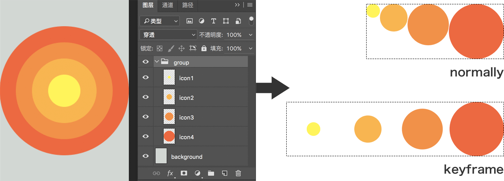

# Lia

[](https://travis-ci.org/cupools/lia)
[](https://coveralls.io/github/cupools/lia?branch=master)

`Lia` 通过 `sprite_conf.js` 的配置命中图片资源，然后输出精灵图片和样式文件到指定文件夹。

如果你更倾向于基于样式文件创建精灵图片，也许你会喜欢 [Emilia](https://github.com/cupools/emilia)

## 特点
- 支持 `rem` 和数值大小转换
- 支持一次性输出多个精灵图片和样式文件
- 支持监听文件改动并按需编译
- 支持在当前文件夹快速创建精灵图片，可用于创建组帧图片和 canvas 动画的场景
- 支持自定义模板输出图片坐标信息，可以是 SCSS, JSON, JS 或者任意格式类型
- 支持直接读取 `.psd` 文件，根据图层或分组输出精灵图片，包括设计稿中的坐标信息

## 使用

#### Step 0
```bash
npm i -g lia
```

```bash
$ lia -h

  Usage: lia [command]

  Commands:

    init                   Create sprite_conf.js
    here                   Build sprite images in current directory
    -w, watch              Monitor file changes and incremental recompilation
    -h, help               Output usage information
```

#### Step 1


```bash
$ lia init
[info]: Created sprite_conf.js
```

#### Step 2

```bash
$ lia
[info]: Created build/sprite.png
[info]: Created build/sprite.css
```

然后就搞定啦。

我们在这个过程中需要关注的只有 `sprite_conf.js`。当执行 `lia init`，会在当前文件夹创建配置文件，如下：

```js
// sprite_conf.js
module.exports = [{
    src: ['*.png'],
    image: 'build/sprite.png',
    style: 'build/sprite.css',
    prefix: '',
    cssPath: './',
    unit: 'px',
    convert: 1,
    decimalPlaces: 6,
    blank: 0,
    padding: 10,
    algorithm: 'binary-tree',
    tmpl: '',
    psd: '',
    quiet: false
}];
```

在上面的示例中，最终输出 `sprite.css` 和 `sprite.png`

```css
/* build/sprite.css */
.icon0 {
    width: 256px;
    height: 256px;
    background: url('./sprite.png') no-repeat;
    background-size: 522px 366px;
    background-position: 0px 0px;
}
.icon1 {
    width: 256px;
    height: 256px;
    background: url('./sprite.png') no-repeat;
    background-size: 522px 366px;
    background-position: -266px 0px;
}
.icon2 {
    width: 100px;
    height: 100px;
    background: url('./sprite.png') no-repeat;
    background-size: 522px 366px;
    background-position: 0px -266px;
}
```


在得到了样式文件和精灵图片之后，可以通过 `@extend` 或者直接通过选择器使用。

## 参数
### src
- 类型: `Array`
- 描述: 图片路径, 使用 [glob-patterns](https://github.com/isaacs/node-glob)
- default: ['*.png']

### image
- 类型: `String`
- 描述: 精灵图片的输出路径
- 默认: 'build/sprite.png'

### style
- 类型: `String`
- 描述: 样式文件的输出路径，可以是 `css`, `scss`，也可以配合 [tmpl](#tmpl) 输出 `js`, `json` 或者其他任意格式类型的文件
- 默认: 'build/sprite.css'

### prefix
- 类型: `String`
- 描述: 样式选择器前缀
- 默认: ''

### cssPath
- 类型: `String`
- 描述: 图片的 url 前缀
- 默认: '../images/'

### unit
- 类型: `String`
- 描述: CSS 使用的单位
- 默认: 'px'

### convert
- 类型: `Number`
- 描述: 缩放的数值大小，可以用在 `rem` 或者 Retina 场景
- 默认: 1

### declimalPlaces
- 类型: `Number`
- 描述: 保留多少位小数点，一般跟 `convert` 一起使用
- 默认: 6

### blank
- 类型: `Number`
- 描述: 在背景图的边缘留一点空白，避免 `rem` 小数值计算造成的图片显示不全的问题
- 默认: 0

### padding
- 类型: `Number`
- 描述: 图片之间的间距
- 默认: 10

### algorithm
- 类型: `String`
- 描述: 精灵图片的排序算法。使用 [layout](https://www.npmjs.com/package/layout)
- value: ['top-down' | 'left-right' | 'diagonal' | 'alt-diagonal' | 'binary-tree']
- 默认: 'binary-tree'

### tmpl
- 类型: `String`
- 描述: 模板文件的路径，用来将坐标信息输出为各种格式的文件。使用 [Ejs](https://github.com/tj/ejs)
- 默认: ''

### psd
- 类型: `String`
- 描述: psd 文件的路径。如果存在，`src` 会匹配 psd 中的图层或分组名称
- 默认: ''

## 示例

### 在当前文件夹快速创建精灵图片

```bash
$ lia here
[info]: Created sprite-keyframe.png
```

当前文件夹中的所有图片将会被合并输出一张精灵图片，使用 `left-right` 的布局方式，按照文件名排序，padding 为 0。不输出样式文件。

From:

 
 


To:


### 2. 监听文件变动
`sprite_conf.js` 的内容如下：

```js
// sprite_conf
module.exports = [{
    src: ['animal/*.png'],
    image: './sprites/sp-animal.png',
    style: './sprites/sp-animal.scss',
    cssPath: './',
    unit: 'px',
}, {
    src: ['icon/*.png'],
    image: './sprites/sp-icon.png',
    style: './sprites/sp-icon.scss',
    cssPath: './',
    unit: 'px',
}];
```

执行 `lia watch`

```bash
$ lia -w
[info]: Created ./sprites/sp-animal.png
[info]: Created ./sprites/sp-animal.scss
[info]: Created ./sprites/sp-icon.png
[info]: Created ./sprites/sp-icon.scss
[info]: Finish in 76ms. Waiting...
[info]: Created ./sprites/sp-animal.png
[info]: Created ./sprites/sp-animal.scss
[info]: Finish in 32ms. Waiting...
```

### 3. 自定义模板，基于 `Ejs`

`Lia` 支持将精灵图的坐标信息通过自定义模板输出为任意格式的文件。这个功能在 Canvas 动画或者其他使用场景可能会有帮助。

#### 上下文
模板文件中的上下文如下

```js
{
    basename: '', // sprite image's basename
    path: '', // sprites image's relative path
    realpath: '', // sprites image's realpath
    unit: '',
    size: {
        with: 0,
        height: 0
    },
    items: [{
        name: '', // origin image's basename
        size: {
            width: 0,
            height: 0
        },
        x: 0, // offset x
        y: 0, // offset y
        layer: { // Photoshop layer information if `psd` exist
            name: '', // layer name
            top: 0, // coordinate in Photoshop
            left: 0,
            right: 0,
            bottom: 0,
            width: 0,
            height: 0
        }
    }, ...],
    psd: { // Photoshop file information if `psd` exist
        width: 0,
        height: 0
    },
    _options: {} // the options you provide, can also inject some other data
}
```

默认的模板文件可以参考 [template.ejs](https://github.com/cupools/lia/blob/master/src/tmpl/template.ejs)

#### 使用
`sprite_conf.js` 如下

```js
// sprite_conf.js
module.exports = [{
    src: ['test/fixtures/*.png'],
    image: 'test/tmp/sprite.png',
    style: 'test/tmp/sprite.js',
    tmpl: 'test/fixtures/template.ejs'
}];
```

自定义的模板文件 `template.ejs` 如下

```js
// template.ejs
var opt = {
    width: <%= size.width %>,
    height: <%= size.height %>,
    src: '<%= realpath %>',
    count: <%= items.length %>,
    items: [
<% items.forEach(function(item, idx) { -%>
    {
        index: <%= idx %>,
        name: '<%= item.name %>',
        width: <%= item.size.width %>,
        height: <%= item.size.height %>,
        x: <%= item.x %>
        y: <%= item.y %>
    },
<% }) -%>
    ]
}
```

运行命令

```bash
$ lia
[info]: Created test/tmp/sprite.png
[info]: Created test/tmp/sprite.js
```

最后得到 `sprite.js` 和 `sprite.png`

```js
// sprite.js
var opt = {
    width: 522,
    height: 256,
    src: '/Users/Lance/home/lia/test/tmp/sprite.png',
    count: 2,
    items: [
    {
        index: 0,
        name: 'icon0',
        width: 256,
        height: 256,
        x: 0
        y: 0
    },
    {
        index: 1,
        name: 'icon1',
        width: 256,
        height: 256,
        x: 266
        y: 0
    },
    ]
}
```

### 4. 配合 `.psd` 输出图片
Lia 能够直接读取 psd 文件中的图层和分组。当配置了 psd 文件的路径，`src` 将会通过 Glob 规则匹配 psd 中图层或者分组的名称，而非文件路径。

同时 Lia 支持输出普通的精灵图片和组帧精灵图片。



```js
// normal
module.exports = [{
    src: 'icon*',
    image: 'build/sprite.png',
    style: 'build/sprite.css',
    padding: 0,
    algorithm: 'left-right',
    psd: 'demo.psd'
}]
```

```js
// keyframes
module.exports = [{
    src: 'group/',
    image: 'build/sprite.png',
    style: 'build/sprite.css',
    padding: 0,
    algorithm: 'left-right',
    psd: 'demo.psd'
}]
```

为了方便使用，当且仅当 `src` 是一个单独的 psd 分组名称并且以 `/` 结束会被识别为组帧精灵图片，分组下的每一个可见图层为宽高一致的一帧。否则，`src` 将会匹配图层名称，并且忽略不可见的图层和所有分组。

目前为了避免图片大小数据错误和图层蒙版表现问题，__每一个需要被导出的图片都需要在执行 Lia 之前栅格化__。目前建议通过 Photoshop 动作去处理合并图层和栅格化这些重复的工作。这个问题会在之后的版本中解决或绕过。

除此之外，执行 Lia 的过程中，会在模板中的上下文中提供可用的 Photoshop 的坐标信息等数据。这将能够自动化将元素定位到 viewport 中，通过 CSS 或 JavaScript 都行。下面是一个 CSS 的示例。

配置文件:

```js
module.exports = [{
    src: 'icon*',
    image: 'build/sprite.png',
    style: 'build/sprite.css',
    algorithm: 'left-right',
    padding: 0,
    tmpl: 'css.ejs',
    psd: 'demo.psd'
}]
```

模板: 

```ejs
<% items.forEach(function(item) { -%>
.<%= item.name %> {
    position: absolute;
    top: <%= item.layer.top + unit %>;
    left: <%= item.layer.left + unit %>;
    width: <%= item.size.width + unit %>;
    height: <%= item.size.height + unit %>;
    background: url('<%= path %>') no-repeat;
    background-size: cover;
    background-position: <%= -item.x + unit %> <%= -item.y + unit %>;
}
<% }) -%>
```

输出: 

```css
.icon1 {
    position: absolute;
    top: 96px;
    left: 96px;
    width: 64px;
    height: 64px;
    background: url('./sprite.png') no-repeat;
    background-size: cover;
    background-position: 0px 0px;
}
.icon2 {
    position: absolute;
    top: 64px;
    left: 64px;
    width: 128px;
    height: 128px;
    background: url('./sprite.png') no-repeat;
    background-size: cover;
    background-position: -64px 0px;
}
...
```

此外需要注意的是，为了避免图层名称排序与设计稿中实际的图层排序不符，导致输出的精灵图的顺序错误，组帧精灵图的上下文中的帧图片名称不是图层名称而是数字序号。

## 更新日志
- v2.1.0
    - 支持通过 `psd` 参数直接读取 psd 文件输出精灵图片并注入模板上下文
- v2.0.0
    - 更简单和灵活的自定义模板支持，基于 `Ejs` 实现
    - 移除 `wrap` 参数，增加 `decimalPlaces` 参数
    - `$lia here` 默认布局由 `top-down` 调整为 `left-right`
    - 调整默认的配置参数
    - 更健壮和合理的测试覆盖
- v1.2.2
    - 使用 `lodash.sortby` 替代 `Array.prototype.sort` 以修正图片排序问题，常见于 `$lia here`
- v1.2.0
    - 使用 [node-images](https://github.com/zhangyuanwei/node-images) 作为图片引擎，极大提高了编译速度
- v1.1.1
    - 兼容 Node v0.12
- v1.1.0
    - 修复了 Windows 平台下由于 `child_process.execFileSync` 的不恰当的使用导致的致命 Bug
    - 增加单元测试用例
- v1.0.0
    - 由 `Sprites` 更名为 `Lia`
    - 调整默认参数配置
- v0.2.1
    - 添加 `watch` 命令，允许监听文件改动
- v0.1.2
    - 添加 `here` 命令 (之前名为 `now`)，允许在当前文件夹快速创建精灵图
    - 修复滚雪球 Bug, 在编译中排除产出的精灵图片
- v0.1.1
    - 增加 `tmpl` 和 `wrap` 参数，允许将精灵图片的坐标信息输出为任意格式类型的文件
- v0.0.1: 
    - 基本功能

## License

Copyright (c) 2016 cupools

Licensed under the MIT license.
